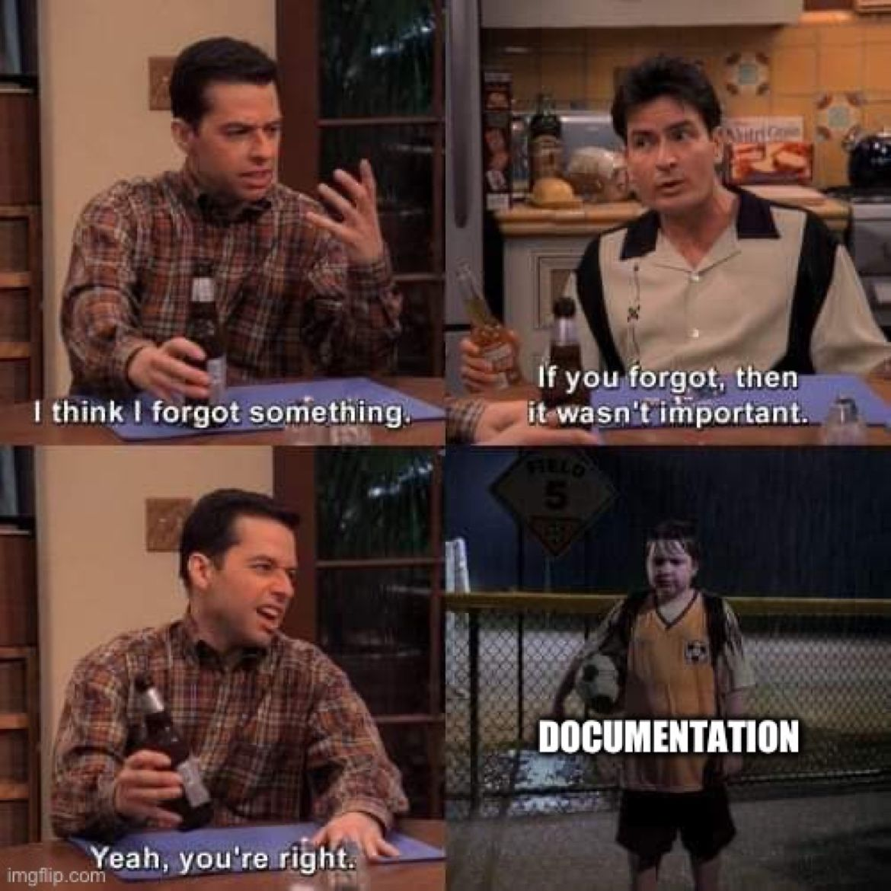

# mkdocs-flake

This project makes integrating `mkdocs` with many plugins to your project easy.

<figure markdown="span">
  { width="400" }
  <figcaption>Documentation should be easy and pretty</figcaption>
</figure>

<div class="grid cards" markdown>

- :simple-materialformkdocs: Pre-Bundled easy to use [Mkdocs](https://www.mkdocs.org/)
- :simple-materialdesign: Cool [Mkdocs Material Design](https://squidfunk.github.io/mkdocs-material)
- [:material-image-edit: Markdown-integrated [PlantUML](https://plantuml.com/)](reference/diagrams.md)
- [:octicons-code-review-24: [Code Blocks](https://squidfunk.github.io/mkdocs-material/reference/code-blocks/) with highlights and annotations](reference/code.md)
- :simple-nixos: Available as [Nix](https://nixos.org/) Flake
- :simple-nixos: Available as [Flake-parts](https://flake.parts/) module
- :simple-docker: Available as [Docker](https://www.docker.com/) Image

</div>

## Try it

### Nix

The best way to use this project is via [Nix](https://nixos.org).

1. [Install Nix](https://nixos.org/download/)
2. Run this command inside your mkdocs project:
  ```console
  nix run github:applicative-systems/mkdocs-flake
  ```

That's it, you can live-edit your documentation.

To do more, as publishing it on GitHub automatically via your CI, please have
a look at our [integration docs](integration/index.md)

### Docker

This repo generates a docker image.

TODO: Document

TODO: Provide dockerhub image from
<https://hub.docker.com/r/applicativesystems/mkdocs>

## Plugins

### Diagrams

[Mermaid](https://squidfunk.github.io/mkdocs-material/reference/diagrams/#usage)
works out of the box, but we also added [PlantUML]() support!

Plantuml is a bit more sophisticated than Mermaid and contains a
[standard library](https://plantuml.com/stdlib)
with many useful icons and styles.

```plantuml
@startuml
!include <logos/apple-pay>
!include <logos/dinersclub>
!include <logos/discover>
!include <logos/google-pay>
!include <logos/jcb>
!include <logos/maestro>
!include <logos/mastercard>
!include <logos/paypal>
!include <logos/unionpay>
!include <logos/visaelectron>
!include <logos/visa>
' ...

title Gil Barbara's logos example - **Payment Scheme**

actor customer
rectangle "<$apple-pay>"    as ap
rectangle "<$dinersclub>"   as dc
rectangle "<$discover>"     as d
rectangle "<$google-pay>"   as gp
rectangle "<$jcb>"          as j
rectangle "<$maestro>"      as ma
rectangle "<$mastercard>"   as m
rectangle "<$paypal>"       as p
rectangle "<$unionpay>"     as up
rectangle "<$visa>"         as v
rectangle "<$visaelectron>" as ve
rectangle "..." as etc

customer --> ap
customer ---> dc
customer --> d
customer ---> gp
customer --> j
customer ---> ma
customer --> m
customer ---> p
customer --> up
customer ---> v
customer --> ve
customer ---> etc
@enduml
```

```plantuml
@startuml
Alice -> Bob: Authentication Request
Bob --> Alice: Authentication Response

Alice -> Bob: Another authentication Request
Alice <-- Bob: Another authentication Response
@enduml
```

```plantuml
@startuml
!theme spacelab
a -> b
b -> c
@enduml
```

```plantuml
@startuml
!include <archimate/Archimate>

title Archimate Sample - Internet Browser

' Elements
Business_Object(businessObject, "A Business Object")
Business_Process(someBusinessProcess,"Some Business Process")
Business_Service(itSupportService, "IT Support for Business (Application Service)")

Application_DataObject(dataObject, "Web Page Data \n 'on the fly'")
Application_Function(webpageBehaviour, "Web page behaviour")
Application_Component(ActivePartWebPage, "Active Part of the web page \n 'on the fly'")

Technology_Artifact(inMemoryItem,"in memory / 'on the fly' html/javascript")
Technology_Service(internetBrowser, "Internet Browser Generic & Plugin")
Technology_Service(internetBrowserPlugin, "Some Internet Browser Plugin")
Technology_Service(webServer, "Some web server")

'Relationships
Rel_Flow_Left(someBusinessProcess, businessObject, "")
Rel_Serving_Up(itSupportService, someBusinessProcess, "")
Rel_Specialization_Up(webpageBehaviour, itSupportService, "")
Rel_Flow_Right(dataObject, webpageBehaviour, "")
Rel_Specialization_Up(dataObject, businessObject, "")
Rel_Assignment_Left(ActivePartWebPage, webpageBehaviour, "")
Rel_Specialization_Up(inMemoryItem, dataObject, "")
Rel_Realization_Up(inMemoryItem, ActivePartWebPage, "")
Rel_Specialization_Right(inMemoryItem,internetBrowser, "")
Rel_Serving_Up(internetBrowser, webpageBehaviour, "")
Rel_Serving_Up(internetBrowserPlugin, webpageBehaviour, "")
Rel_Aggregation_Right(internetBrowser, internetBrowserPlugin, "")
Rel_Access_Up(webServer, inMemoryItem, "")
Rel_Serving_Up(webServer, internetBrowser, "")
@enduml
```

Worth mentioning is especially the [C4](https://c4model.com/) standard library:

```plantuml
@startuml
!include <C4/C4_Container>

Person(personAlias, "Label", "Optional Description")
Container(containerAlias, "Label", "Technology", "Optional Description")
System(systemAlias, "Label", "Optional Description")

System_Ext(extSystemAlias, "Label", "Optional Description")

Rel(personAlias, containerAlias, "Label", "Optional Technology")

Rel_U(systemAlias, extSystemAlias, "Label", "Optional Technology")
@enduml
```


### Code

The code blocks with annotation support as
[documented by mkdocs-material](https://squidfunk.github.io/mkdocs-material/reference/code-blocks/)
work out of the box:

``` py title="bubble_sort.py"
def bubble_sort(items):
    for i in range(len(items)):
        for j in range(len(items) - 1 - i): # (1)
            if items[j] > items[j + 1]:
                items[j], items[j + 1] = items[j + 1], items[j]
```

1.  :man_raising_hand: I'm a code annotation! I can contain `code`, __formatted
    text__, images, ... basically anything that can be written in Markdown.

### Math

You can use [MathJax](https://squidfunk.github.io/mkdocs-material/reference/math/#mathjax)
and [KaTeX](https://squidfunk.github.io/mkdocs-material/reference/math/#katex)
out of the box:

$$
\operatorname{ker} f=\{g\in G:f(g)=e_{H}\}{\mbox{.}}
$$
